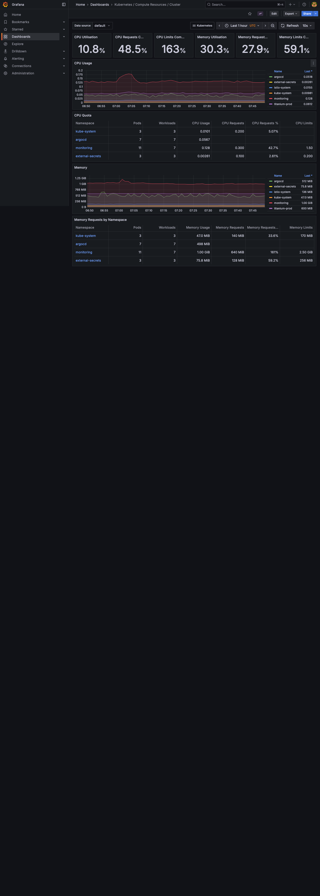
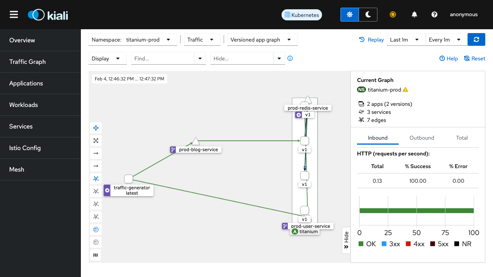
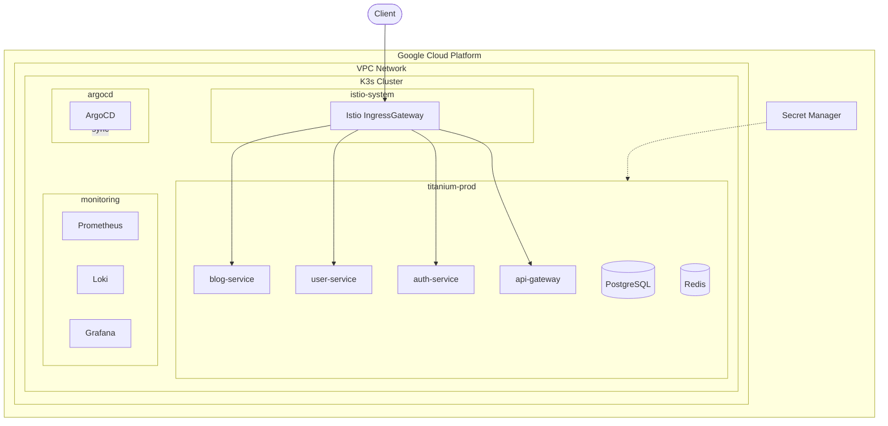
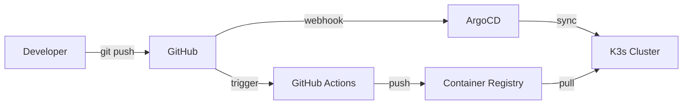

# Titanium Monitoring Platform

GCP 기반 K3s Kubernetes Cluster에서 운영되는 Microservice Monitoring Platform.
Terraform(IaC), ArgoCD(GitOps), Istio(Service Mesh)를 통해 End-to-End 자동화를 구현한다.

| Grafana - Cluster Metrics | Kiali - Service Mesh |
|:-------------------------:|:--------------------:|
|  |  |

## 주요 특징

| 영역 | 구현 |
|------|------|
| Infrastructure as Code | Terraform으로 GCP 리소스 전체 자동화 |
| GitOps | ArgoCD App of Apps 패턴으로 선언적 배포 |
| Service Mesh | Istio mTLS 기반 Zero Trust 네트워크 |
| Observability | Prometheus + Loki + Grafana 통합 모니터링 |
| Secret Management | External Secrets + GCP Secret Manager |

## 기술 스택

| 계층 | 기술 |
|------|------|
| Cloud Provider | Google Cloud Platform (GCP) |
| Kubernetes | K3s v1.31 |
| IaC | Terraform |
| GitOps | ArgoCD |
| Service Mesh | Istio v1.24 |
| Monitoring | Prometheus, Loki, Grafana |
| Secret Management | External Secrets Operator |
| Container Registry | GitHub Container Registry (ghcr.io) |
| CI/CD | GitHub Actions |

## 아키텍처

### 시스템 개요



### GitOps 배포 흐름



## 디렉토리 구조

```
Monitoring-v3/
├── terraform/                    # Infrastructure as Code
│   └── environments/
│       └── gcp/                  # GCP 환경 Terraform
├── apps/                         # ArgoCD Application 정의
│   ├── root-app.yaml             # App of Apps 진입점
│   ├── infrastructure/           # Infrastructure Apps
│   └── applications/             # Application Apps
├── k8s-manifests/                # Kubernetes 리소스
│   ├── base/                     # 공통 리소스
│   └── overlays/
│       ├── gcp/                  # GCP Production
│       ├── staging/              # Staging
│       └── local/                # Local Development
├── api-gateway/                  # Go (Gin) - API 라우팅
├── auth-service/                 # Python (FastAPI) - JWT 인증
├── user-service/                 # Python (FastAPI) - 사용자 관리
├── blog-service/                 # Python (FastAPI) - 블로그 + Frontend
├── scripts/                      # 유틸리티 스크립트
├── docs/                         # 문서
│   ├── architecture/             # 아키텍처 문서
│   └── demo/                     # 데모 스크린샷
└── tests/                        # Terratest 테스트
```

## 빠른 시작

### 사전 요구사항

- Terraform >= 1.5
- Google Cloud SDK (gcloud)
- kubectl
- SSH Key Pair

### 인프라 배포

```bash
cd terraform/environments/gcp

# 1. SSH 키 생성 (없는 경우)
ssh-keygen -t rsa -b 4096 -f ~/.ssh/titanium-key -N ""

# 2. terraform.tfvars 설정
cat > terraform.tfvars << 'EOF'
project_id = "your-gcp-project-id"
ssh_public_key_path = "~/.ssh/titanium-key.pub"

# 현재 IP에서 Dashboard 접근 허용 (선택)
admin_cidrs = ["YOUR_IP/32"]
EOF

# 3. 민감한 변수는 환경변수로 설정
export TF_VAR_postgres_password="your-secure-password"
export TF_VAR_grafana_admin_password="your-grafana-password"

# 4. 배포
terraform init
terraform apply
```

**admin_cidrs 미설정 시**: SSH 터널을 통해 Dashboard에 접근 가능.
```bash
gcloud compute ssh titanium-k3s-master --tunnel-through-iap -- -L 30080:localhost:30080
```

배포 완료 후 약 10분 내에 전체 스택이 자동 구성된다:
1. K3s Cluster 설치 (Master + Workers)
2. ArgoCD 설치 및 Root App 등록
3. Infrastructure Apps Sync (Istio, Prometheus, Loki, External Secrets)
4. Application Apps Sync (titanium-prod)

### 접속 정보

| 서비스 | URL | 비고 |
|--------|-----|------|
| Blog Application | `http://<MASTER_IP>:31080/blog/` | Istio IngressGateway |
| ArgoCD | `http://<MASTER_IP>:30080` | admin / `kubectl -n argocd get secret argocd-initial-admin-secret -o jsonpath='{.data.password}' \| base64 -d` |
| Grafana | `http://<MASTER_IP>:31300/grafana/` | admin / TF_VAR_grafana_admin_password |
| Kiali | `http://<MASTER_IP>:31200/kiali/` | Service Mesh Dashboard |

### 리소스 제거

```bash
terraform destroy
```

## Application 구성

| Service | 기술 | 포트 | 역할 |
|---------|------|------|------|
| api-gateway | Go (Gin) | 8000 | API 라우팅, Rate Limiting |
| auth-service | Python (FastAPI) | 8002 | JWT 인증, 로그인 |
| user-service | Python (FastAPI) | 8001 | 사용자 CRUD |
| blog-service | Python (FastAPI) | 8005 | 블로그 CRUD, Frontend |
| postgresql | PostgreSQL 15 | 5432 | 영구 데이터 저장 |
| redis | Redis 7 | 6379 | JWT Token 캐싱 |

## 보안

| 계층 | 구현 |
|------|------|
| Network | GCP Firewall + Kubernetes NetworkPolicy (Zero Trust) |
| Transport | Istio mTLS (STRICT mode) |
| Authentication | JWT (auth-service 발급) |
| Secret | External Secrets + GCP Secret Manager |
| Container | Non-root user, Read-only filesystem |

## 문서

| 문서 | 설명 |
|------|------|
| [Architecture](docs/architecture/README.md) | 상세 아키텍처 문서 |
| [ADR](docs/architecture/adr/) | Architecture Decision Records |
| [Demo](docs/demo/README.md) | GCP Production 환경 데모 |
| [Troubleshooting](docs/TROUBLESHOOTING.md) | IaC 배포 및 테스트 문제 해결 |
| [Secret Management](docs/secret-management.md) | Secret 관리 가이드 |

## License

MIT License
