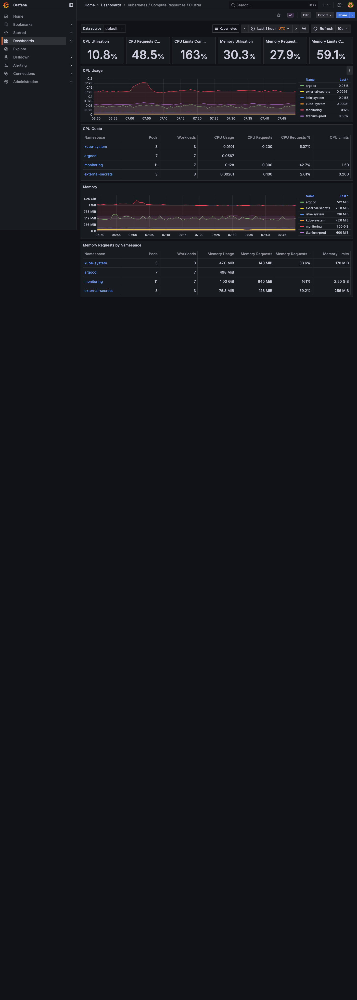
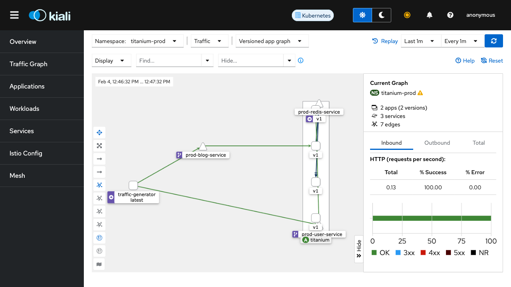
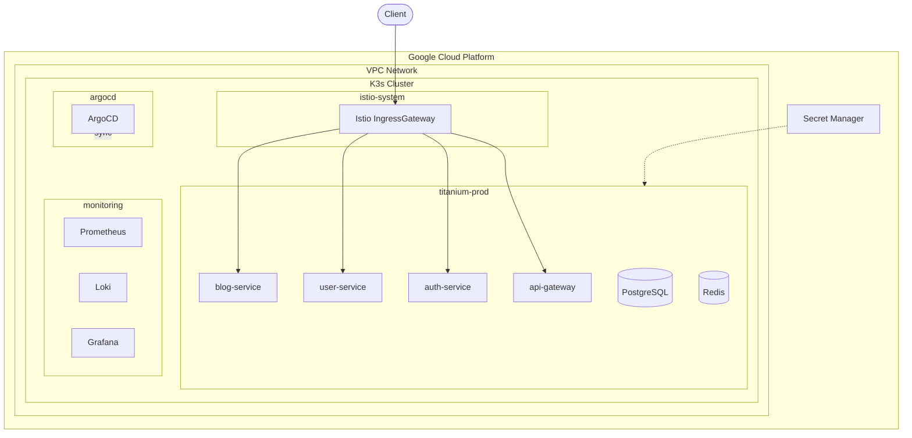
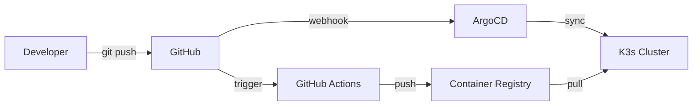

# Titanium Monitoring Platform

GCP 기반 K3s Kubernetes Cluster에서 운영되는 Microservice Monitoring Platform.
Terraform(IaC), ArgoCD(GitOps), Istio(Service Mesh)를 통해 인프라 프로비저닝부터 애플리케이션 배포까지 자동화를 구현한다.
Claude Code와 git worktree를 활용하여 개발하였으며, 문서화 재구성은 Agent Teams Scrum으로 진행하였다.

<table>
  <tr>
    <td align="center"><b>Grafana - Cluster Metrics</b></td>
    <td align="center"><b>Kiali - Service Mesh</b></td>
  </tr>
  <tr>
    <td></td>
    <td></td>
  </tr>
</table>

## 주요 특징

| 영역 | 구현 |
|------|------|
| Infrastructure as Code | Terraform으로 GCP 리소스 프로비저닝 자동화 |
| GitOps | ArgoCD App of Apps 패턴으로 선언적 배포 |
| Service Mesh | Istio mTLS 기반 Zero Trust 네트워크 |
| Observability | Prometheus + Loki + Grafana 통합 모니터링 |
| Secret Management | External Secrets + GCP Secret Manager |
| AI-Assisted Development | Claude Code + git worktree 기반 개발, Agent Teams Scrum 기반 문서화 |

## 기술 스택

| 계층 | 기술 |
|------|------|
| Cloud Provider | Google Cloud Platform (GCP) |
| Kubernetes | K3s v1.31.4+k3s1 |
| IaC | Terraform |
| GitOps | ArgoCD |
| Service Mesh | Istio v1.24.2 |
| Monitoring | Prometheus, Loki, Grafana |
| Secret Management | External Secrets Operator |
| Container Registry | GitHub Container Registry (ghcr.io) |
| CI/CD | GitHub Actions |
| AI Development | Claude Code, MCP (Playwright) |
| Documentation | Agent Teams, Scrum |

## AI Agent 워크로드 확장 구조

본 프로젝트의 인프라는 Kubernetes 기반이므로 AI Agent 워크로드 추가 배포가 구조적으로 가능하다.

| 구현 완료 | AI Agent 확장 가능 영역 | 기술적 근거 |
|-----------|----------------------|-------------|
| K3s Cluster 운영 | LLM 추론 서버 배포 (vLLM, KServe) | Kubernetes 기반 워크로드 오케스트레이션 |
| Prometheus + Grafana | LLM Observability (토큰 사용량, 레이턴시) | Grafana LLM Plugin, OpenTelemetry GenAI SIG |
| Loki 로그 수집 | 프롬프트/응답 트레이싱 | 중앙 집중 로그 파이프라인 구조 동일 |
| Istio mTLS | Multi-Agent 간 보안 통신 | Zero Trust 네트워크 정책 |
| ArgoCD GitOps | ML/LLM 모델 선언적 배포 | App of Apps 패턴으로 서비스 추가 가능 |
| External Secrets | LLM API Key 보안 관리 | GCP Secret Manager 연동 |

상세: [LLM Observability 적용 가이드](docs/09-llm-observability/README.md)

## AI-Assisted Development

본 프로젝트는 Claude Code와 git worktree를 활용하여 개발하였다.

| 항목 | 수치 |
|------|------|
| 병렬 worktree | 7개 |
| Claude Code 허용 명령어 | 300+ |
| MCP 연동 | Playwright |

문서화 재구성은 Agent Teams(3명)를 구성하여 Scrum으로 진행하였다.

상세: [AI 개발 워크플로우](docs/08-ai-dev-workflow/README.md) | [Scrum 프로세스](docs/10-scrum-process/README.md)

## 아키텍처

### 시스템 개요


```mermaid
flowchart TB
    subgraph GCP["Google Cloud Platform"]
        subgraph VPC["VPC Network"]
            subgraph K3s["K3s Cluster"]
                subgraph istio["istio-system"]
                    IGW[Istio IngressGateway]
                end
                subgraph app["titanium-prod"]
                    API[api-gateway]
                    Auth[auth-service]
                    User[user-service]
                    Blog[blog-service]
                    PG[(PostgreSQL)]
                    Redis[(Redis)]
                end
                subgraph mon["monitoring"]
                    Prom[Prometheus]
                    Loki[Loki]
                    Grafana[Grafana]
                end
                subgraph argo["argocd"]
                    ArgoCD[ArgoCD]
                end
            end
        end
        SM[Secret Manager]
    end

    Client([Client]) --> IGW
    IGW --> API & Auth & User & Blog
    SM -.-> app
    ArgoCD -.->|sync| K3s
```

### GitOps 배포 흐름


```mermaid
flowchart LR
    Dev[Developer] -->|git push| Repo[GitHub]
    Repo -->|webhook| ArgoCD
    Repo -->|trigger| Actions[GitHub Actions]
    Actions -->|push| GHCR[Container Registry]
    ArgoCD -->|sync| K3s[K3s Cluster]
    GHCR -->|pull| K3s
```

AI Agent 관점 아키텍처는 [Architecture 문서](docs/architecture/README.md)를 참조한다.

## 디렉토리 구조

```
Monitoring-v3/
├── terraform/                    # Infrastructure as Code
│   └── environments/
│       └── gcp/                  # GCP 환경 Terraform
├── apps/                         # ArgoCD Application 정의
│   ├── root-app.yaml             # App of Apps 진입점
│   ├── infrastructure/           # Infrastructure Apps
│   └── applications/             # Application Apps
├── k8s-manifests/                # Kubernetes 리소스
│   ├── base/                     # 공통 리소스
│   └── overlays/
│       ├── gcp/                  # GCP Production
│       ├── staging/              # Staging
│       └── local/                # Local Development
├── api-gateway/                  # Go (net/http) - API 라우팅
├── auth-service/                 # Python (FastAPI) - JWT 인증
├── user-service/                 # Python (FastAPI) - 사용자 관리
├── blog-service/                 # Python (FastAPI + Jinja2) - 블로그 + Frontend
├── scripts/                      # 유틸리티 스크립트
├── docs/                         # 문서
│   ├── architecture/             # 아키텍처 문서
│   ├── demo/                     # 데모 스크린샷
│   ├── 08-ai-dev-workflow/       # AI 개발 워크플로우
│   ├── 09-llm-observability/     # LLM Observability 적용 가이드
│   ├── 10-scrum-process/         # Scrum 프로세스 기록
│   ├── 04-troubleshooting/       # IaC 배포 및 테스트 문제 해결 (카테고리별)
│   ├── secret-management.md      # Secret 관리 가이드
│   └── operational-changes.md    # 운영 변경 이력
└── tests/                        # 종합 테스트 (Smoke, Integration, E2E)
```

## 빠른 시작

### 사전 요구사항

- Terraform >= 1.5
- Google Cloud SDK (gcloud)
- kubectl
- SSH Key Pair

### 인프라 배포

```bash
cd terraform/environments/gcp

# 1. SSH 키 생성 (없는 경우)
ssh-keygen -t rsa -b 4096 -f ~/.ssh/titanium-key -N ""

# 2. terraform.tfvars 설정
cat > terraform.tfvars << 'EOF'
project_id = "your-gcp-project-id"
ssh_public_key_path = "~/.ssh/titanium-key.pub"

# 현재 IP에서 Dashboard 접근 허용 (선택)
admin_cidrs = ["YOUR_IP/32"]
EOF

# 3. 민감한 변수는 환경변수로 설정
export TF_VAR_postgres_password="your-secure-password"
export TF_VAR_grafana_admin_password="your-grafana-password"

# 4. 배포
terraform init
terraform apply
```

**admin_cidrs 미설정 시**: SSH 터널을 통해 Dashboard에 접근 가능.
```bash
gcloud compute ssh titanium-k3s-master --tunnel-through-iap -- -L 30080:localhost:30080
```

배포 완료 후 ArgoCD가 Infrastructure/Application Apps를 자동 동기화한다:
1. K3s Cluster 설치 (Master + Workers)
2. ArgoCD 설치 및 Root App 등록
3. Infrastructure Apps Sync (Istio, Prometheus, Loki, External Secrets)
4. Application Apps Sync (titanium-prod)

### 접속 정보

| 서비스 | URL | 비고 |
|--------|-----|------|
| Blog Application | `http://<MASTER_IP>:31080/blog/` | Istio IngressGateway |
| ArgoCD | `http://<MASTER_IP>:30080` | admin / `kubectl -n argocd get secret argocd-initial-admin-secret -o jsonpath='{.data.password}' \| base64 -d` |
| Grafana | `http://<MASTER_IP>:31300/grafana/` | admin / TF_VAR_grafana_admin_password |
| Kiali | `http://<MASTER_IP>:31200/kiali/` | Service Mesh Dashboard |

### 리소스 제거

```bash
terraform destroy
```

## Application 구성

| Service | 기술 | 포트 | 역할 |
|---------|------|------|------|
| api-gateway | Go (net/http) | 8000 | API 라우팅, Rate Limiting |
| auth-service | Python (FastAPI) | 8002 | JWT 인증, 로그인 |
| user-service | Python (FastAPI) | 8001 | 사용자 CRUD |
| blog-service | Python (FastAPI + Jinja2) | 8005 | 블로그 CRUD, Frontend |
| postgresql | PostgreSQL 15 | 5432 | 영구 데이터 저장 |
| redis | Redis 7 | 6379 | JWT Token 캐싱 |

## 보안

| 계층 | 구현 |
|------|------|
| Network | GCP Firewall + Kubernetes NetworkPolicy (Zero Trust) |
| Transport | Istio mTLS (STRICT mode) |
| Authentication | JWT (auth-service 발급) |
| Secret | External Secrets + GCP Secret Manager |
| Container | Non-root user, Read-only filesystem |

## 정량적 지표

| 영역 | 지표 |
|------|------|
| 개발 | git worktree 7개 병렬 개발 |
| 인프라 테스트 | Terratest 7 Layer, 4,327줄 Go 코드 |
| 의사결정 | ADR 10건 |
| 트러블슈팅 | 19건 문서화 |
| 데모 | GCP 환경 스크린샷 23종 |

## 문서

| 문서 | 설명 |
|------|------|
| [Architecture](docs/architecture/README.md) | 상세 아키텍처 문서 |
| [ADR](docs/architecture/adr/) | Architecture Decision Records |
| [Demo](docs/demo/README.md) | GCP Production 환경 데모 |
| [Troubleshooting](docs/04-troubleshooting/README.md) | IaC 배포 및 테스트 문제 해결 |
| [Secret Management](docs/secret-management.md) | Secret 관리 가이드 |
| [AI 개발 워크플로우](docs/08-ai-dev-workflow/README.md) | Claude Code + git worktree 개발 과정 |
| [LLM Observability](docs/09-llm-observability/README.md) | LLM Observability 적용 가이드 |
| [Scrum 프로세스](docs/10-scrum-process/README.md) | Agent Teams Scrum 프로세스 기록 |

## License

MIT License
