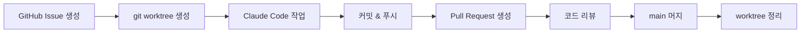
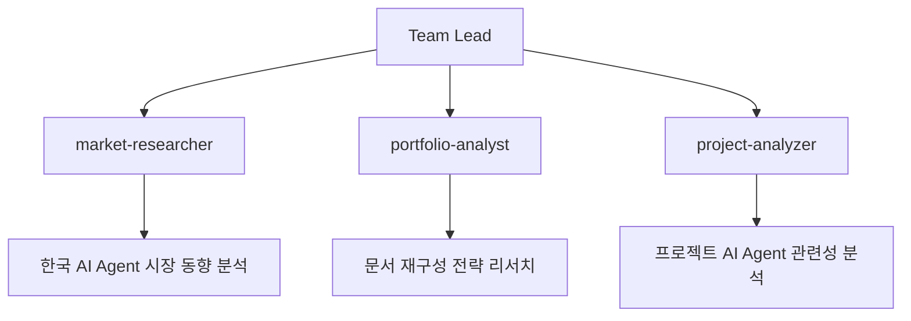
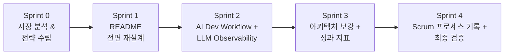

# AI 개발 워크플로우

## 개요

본 프로젝트는 두 가지 AI 활용 방식으로 작업하였다.

- **코드 개발**: Claude Code + git worktree
- **문서화 재구성**: Claude Code Agent Teams + Scrum

---

## 코드 개발: Claude Code + git worktree

### 워크플로우



1. GitHub Issue에서 작업 단위를 정의한다.
2. `git worktree add`로 이슈별 독립 작업 공간을 생성한다.
3. Claude Code에서 코드 작성, 테스트, 디버깅을 수행한다.
4. 커밋 후 Pull Request를 생성하고, 리뷰 후 main 브랜치에 머지한다.

### 개발 환경

- **Claude Code 허용 명령어**: 300+ (terraform, kubectl, gcloud, git 등)
- **MCP 연동**:
  - Playwright MCP: 브라우저 기반 테스트 자동화

### worktree 활용

git worktree로 이슈별 독립 작업 공간을 생성하여 병렬 개발을 진행하였다. 각 worktree는 별도 브랜치에서 작업하므로 main 브랜치에 영향 없이 동시에 여러 이슈를 처리할 수 있다.

```
.git/worktrees/
├── Monitoring-v3-eso-adc            # External Secrets ADC 작업
├── Monitoring-v3-feat-minikube-overlay  # Minikube 오버레이 기능
├── Monitoring-v3-fix-pr80-commit    # PR #80 수정
├── Monitoring-v3-gitops-fix         # GitOps 수정
├── Monitoring-v3-monitoring-routing  # 모니터링 라우팅
├── Monitoring-v3-refactor-terraform  # Terraform 리팩토링
└── Monitoring-v3-test-docs          # 테스트 문서
```

### 개발 수치

| 항목 | 수치 |
|------|------|
| 병렬 worktree | 7개 |
| 개발 기간 | 2025-12-18 ~ 2026-02-10 |

### PR 패턴

GitHub Issue 기반 브랜치 네이밍을 사용하였다. `{type}/{issue번호}-{설명}` 형식으로 브랜치를 생성하고, PR에서 해당 이슈를 참조한다.

| 브랜치명 | PR |
|----------|-----|
| `fix/83-istio-ingressgateway-nodeport` | #84 |
| `feat/77-app-of-apps-pattern` | #78 |
| `fix/74-blog-auth-networkpolicy` | #75 |
| `feature/72-kiali-auto-connect` | #73 |
| `fix/68-istio-proxy-csr-failure` | #69 |
| `refactor/eso-adc-auth` | #99 |

---

## 문서화 재구성: Agent Teams + Scrum

### 배경

프로젝트 문서를 AI Agent 관점으로 재구성하기 위해 Claude Code Agent Teams를 구성하여 Scrum으로 진행하였다.

### Agent Teams 구성



| Agent | 역할 |
|-------|------|
| market-researcher | 한국 AI Agent 시장 동향 분석 |
| portfolio-analyst | 문서 재구성 전략 리서치 |
| project-analyzer | 프로젝트 AI Agent 관련성 분석 |

### Scrum Sprint 구성



| Sprint | 내용 | 비고 |
|--------|------|------|
| Sprint 0 | 시장 분석 & 전략 수립 | Agent Teams 3명 병렬 리서치 |
| Sprint 1 | README 전면 재설계 | AI Agent 관점 구조 개편 |
| Sprint 2 | AI Dev Workflow + LLM Observability 문서 | 기술 문서 신규 작성 |
| Sprint 3 | 아키텍처 보강 + 성과 지표 | 정량 데이터 추가 |
| Sprint 4 | Scrum 프로세스 기록 + 최종 검증 | 문서 정합성 검증 |

## 관련 문서

- [Scrum 프로세스](../10-scrum-process/README.md)
- [LLM Observability 적용 가이드](../09-llm-observability/README.md)
- [Architecture](../architecture/README.md)
