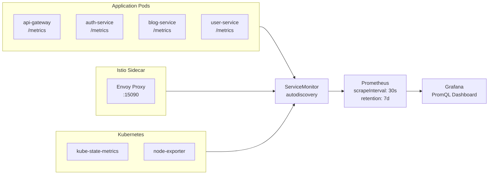
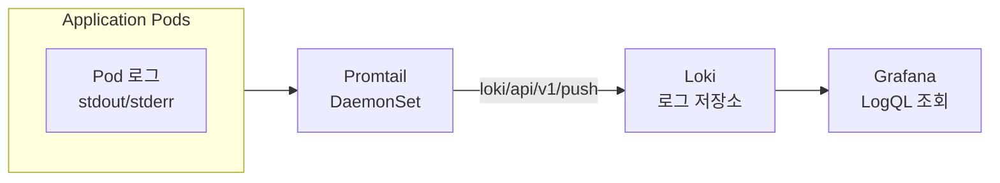
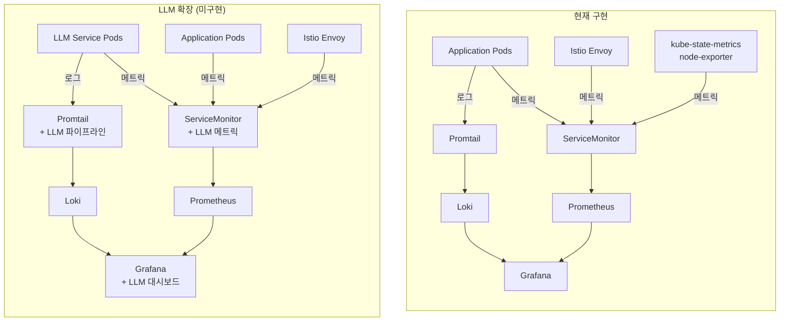

# LLM Observability 적용 가이드

## 개요

본 프로젝트에서 구현한 Prometheus + Loki + Grafana Observability 스택은 Kubernetes 기반이므로 LLM 서비스의 메트릭/로그 수집에도 동일한 파이프라인을 적용할 수 있다. 이 문서는 구현 완료된 인프라와 LLM Observability 확장 가능 영역을 구분하여 기술한다.

---

## 현재 구현된 Observability 스택

### 메트릭 수집 (Prometheus)

- **Application Metrics**: ServiceMonitor autodiscovery (4개 서비스: api-gateway, auth-service, blog-service, user-service)
- **Istio Metrics**: Envoy Sidecar 15090 포트 메트릭 수집
- **Kubernetes Metrics**: kube-state-metrics
- **Node Metrics**: node-exporter

### 로그 수집 (Loki)

- Promtail → Loki 중앙 집중 로그 파이프라인
- Application Pod 로그 자동 수집 (kubernetes_sd_configs)
- JSON 파싱 + Label 추출 pipeline_stages 구성

### 시각화 (Grafana)

- PromQL 기반 메트릭 대시보드
- LogQL 기반 로그 조회
- Prometheus + Loki 데이터소스 통합

---

## LLM Observability 확장 가능 영역

> 아래 내용은 **미구현** 상태이며, 현재 인프라 구조에서 **구조적으로 확장 가능한 영역**을 기술한다.

### 메트릭 확장

| 현재 (구현 완료) | LLM 확장 (미구현, 구조적으로 가능) |
|-----------------|----------------------------------|
| `http_requests_total` (HTTP 요청 수) | `llm_requests_total` (LLM API 호출 수) |
| `http_request_duration` (응답 시간) | `llm_token_latency` (토큰 생성 레이턴시) |
| ServiceMonitor autodiscovery | LLM 서비스 메트릭 자동 수집 |

**기술적 근거**: Prometheus Counter/Histogram 메트릭 타입은 동일하며, ServiceMonitor 설정 추가로 새 서비스 메트릭 수집이 가능하다. 현재 `serviceMonitorSelectorNilUsesHelmValues: false` 설정으로 모든 네임스페이스의 ServiceMonitor를 자동 감지한다.

### 로그 확장

| 현재 (구현 완료) | LLM 확장 (미구현, 구조적으로 가능) |
|-----------------|----------------------------------|
| Application 로그 수집 | 프롬프트/응답 로그 수집 |
| Promtail JSON 파싱 파이프라인 | LLM 입출력 파싱 파이프라인 |
| LogQL 조회 | 프롬프트/응답 트레이싱 조회 |

**기술적 근거**: Promtail은 로그 포맷에 무관하게 수집하며, 현재 `pipeline_stages`에 JSON 파싱과 Label 추출이 구성되어 있다. Loki의 LogQL은 구조화된 메타데이터 필터링을 지원한다.

### 시각화 확장

| 현재 (구현 완료) | LLM 확장 (미구현, 구조적으로 가능) |
|-----------------|----------------------------------|
| Grafana PromQL 대시보드 | LLM 성능 대시보드 |
| 클러스터 리소스 모니터링 | 토큰 사용량/비용 모니터링 |

**기술적 근거**: Grafana Labs는 LLM Observability용 플러그인을 제공하며, OpenTelemetry GenAI SIG에서 LLM 메트릭 표준을 정의하고 있다.

---

## 아키텍처 비교

---

## 관련 기술

| 기술 | 설명 |
|------|------|
| Grafana LLM Plugin | Grafana에서 LLM 메트릭 시각화를 위한 플러그인 |
| OpenTelemetry GenAI SIG | LLM Observability 메트릭 표준 정의 (Semantic Conventions) |
| Langfuse | 오픈소스 LLM Observability 플랫폼 (Kubernetes Helm 배포 지원) |
| LangSmith | LangChain 기반 LLM 트레이싱 및 모니터링 플랫폼 |

---

## 관련 문서

- [Architecture](../architecture/README.md)
- [Monitoring Stack ADR](../architecture/adr/007-monitoring-stack.md)
