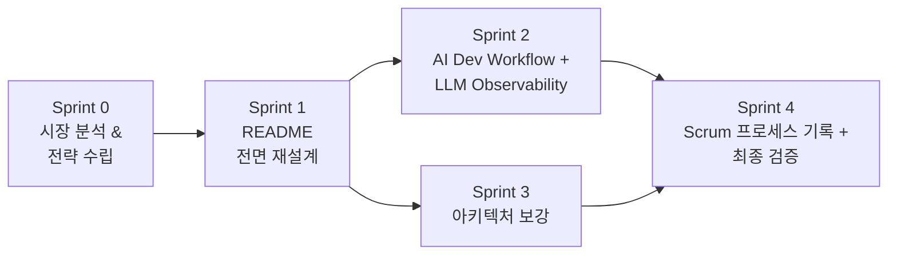

# Scrum 프로세스 기록

## 개요

본 프로젝트의 문서화 재구성은 Claude Code Agent Teams를 구성하여 Scrum으로 진행하였다.
코드 개발(Claude Code + git worktree)과는 별도의 프로세스이다.

## 개발 방식 비교

| 구분 | 코드 개발 | 문서화 재구성 |
|------|----------|-------------|
| 도구 | Claude Code + git worktree | Claude Code Agent Teams |
| 방법론 | 이슈별 worktree 생성 → PR | Scrum Sprint |
| 참여 | 단일 Agent (1:1 협업) | 다중 Agent (Team 협업) |
| 기간 | 2025-12-18 ~ 2026-02-10 | 2026-02-28 |

## Scrum 구성

- Product Owner: 사용자 (문서화 방향 결정)
- Scrum Master + Dev Team: Claude Code Agent Teams

---

## Sprint 0: 시장 분석 & 전략 수립

### Agent Teams 구성

3명의 Agent를 병렬로 실행하여 리서치를 수행하였다.

| Agent | 역할 | 산출물 |
|-------|------|--------|
| market-researcher | 한국 AI Agent 시장 동향 분석 | 시장 분석 보고서 (기술 동향, 주요 기술 스택) |
| portfolio-analyst | 문서 재구성 전략 리서치 | 전략 보고서 (README 최적화, 기술 대응 관계) |
| project-analyzer | 프로젝트 AI Agent 관련성 분석 | 프로젝트 분석 (Claude Code 활용 내역, 기술 대응 관계) |

### Sprint 0 결과

리서치 결과를 종합하여 3가지 접근 방안을 도출하였다.
- 방안 A: README 중심 재구성 (최소 범위)
- 방안 B: 문서 전면 재구성 (채택)
- 방안 C: 문서 + 기술 가이드 통합 패키지

방안 B를 채택하고, 전체 문서화 재구성을 Scrum으로 운영하기로 결정하였다.

### 주요 발견사항

시장 분석:
- 2026년 한국 AI Agent 시장에서 관련 기술 수요가 증가 추세로 분석되었다.
- 주요 기술: Python, LLM, RAG, LangChain, Kubernetes, CI/CD
- MCP/A2A 프로토콜이 신규 기술로 부상

프로젝트 분석:
- .claude/settings.local.json: 300+ 허용 명령어 확인
- .git/worktrees/: 7개 병렬 작업 공간 확인
- MCP 연동: Playwright MCP 사용 확인
- 5개 인프라 컴포넌트의 AI Agent 영역 대응 관계 도출

---

## Sprint 1: README 전면 재설계

| 항목 | 내용 |
|------|------|
| 담당 Agent | sprint1-readme |
| 작업 | README.md 재작성 |
| 산출물 | README.md (270줄) |

변경 사항:
- 프로젝트 설명에 Claude Code + git worktree, Agent Teams Scrum 부제 추가
- 주요 특징 테이블에 "AI-Assisted Development" 항목 추가
- 기술 스택 테이블에 "AI Development", "Documentation" 계층 추가
- "AI Agent 워크로드 확장 구조" 섹션 신규 (6개 기술 대응 관계)
- "AI-Assisted Development" 섹션 신규 (개발 수치 테이블)
- "정량적 지표" 섹션 신규
- 문서 테이블에 신규 3개 문서 링크 추가

---

## Sprint 2: AI Dev Workflow + LLM Observability 문서

| 항목 | 내용 |
|------|------|
| 담당 Agent | sprint2-docs |
| 작업 | 신규 문서 2개 작성 |
| 산출물 | docs/08-ai-dev-workflow/README.md (121줄), docs/09-llm-observability/README.md (150줄) |

docs/08-ai-dev-workflow/README.md:
- 코드 개발 워크플로우 (Mermaid 다이어그램, worktree 7개 목록, 개발 수치, PR 패턴)
- 문서화 재구성 워크플로우 (Agent Teams 구성, Sprint 구성)

docs/09-llm-observability/README.md:
- 현재 구현된 Observability 스택 (Prometheus, Loki, Grafana 흐름도)
- LLM Observability 확장 가능 영역 ("구현 완료" vs "미구현, 구조적으로 가능" 구분)
- 아키텍처 비교 Mermaid 다이어그램

---

## Sprint 3: 아키텍처 보강

| 항목 | 내용 |
|------|------|
| 담당 Agent | sprint3-arch |
| 작업 | docs/architecture/README.md에 2개 섹션 추가 |
| 산출물 | "AI Agent 관점 아키텍처" 섹션, "인프라 기술 — AI Agent 영역 대응 관계" 섹션 |

추가 내용:
- AI Agent 관점 아키텍처: 마이크로서비스 → Agent 관점 재라벨링 Mermaid 다이어그램 + 구조적 유사성 테이블 6개 항목
- 인프라 기술 — AI Agent 영역 대응 관계: 인프라 역량(구현 완료) → AI Agent 확장 가능 영역 매핑 테이블 10개 항목
- "재라벨링"임을 명시, 구조적 유사성만 기술

---

## Sprint 4: Scrum 프로세스 기록 + 최종 검증

| 항목 | 내용 |
|------|------|
| 담당 Agent | sprint4-final |
| 작업 | Scrum 프로세스 문서 작성, 문서 정합성 검증 |
| 산출물 | docs/10-scrum-process/README.md (본 문서) |

---

## Sprint 의존성

Sprint 0 완료 → Sprint 1 시작
Sprint 1 완료 → Sprint 2, Sprint 3 병렬 시작
Sprint 2, Sprint 3 완료 → Sprint 4 시작

---

## 산출물 목록

| 파일 | 작업 | Sprint |
|------|------|--------|
| README.md | 수정 | Sprint 1 |
| docs/08-ai-dev-workflow/README.md | 신규 | Sprint 2 |
| docs/09-llm-observability/README.md | 신규 | Sprint 2 |
| docs/architecture/README.md | 보강 | Sprint 3 |
| docs/10-scrum-process/README.md | 신규 | Sprint 4 |

---

## 관련 문서

- [AI 개발 워크플로우](../08-ai-dev-workflow/README.md)
- [LLM Observability 적용 가이드](../09-llm-observability/README.md)
- [Architecture](../architecture/README.md)
