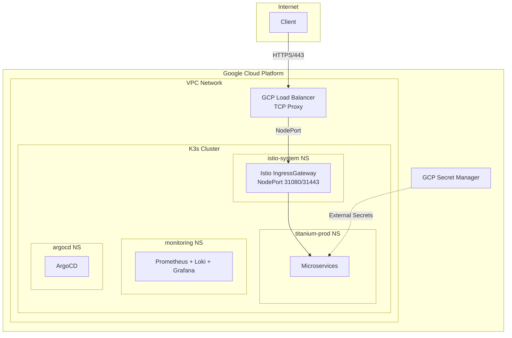
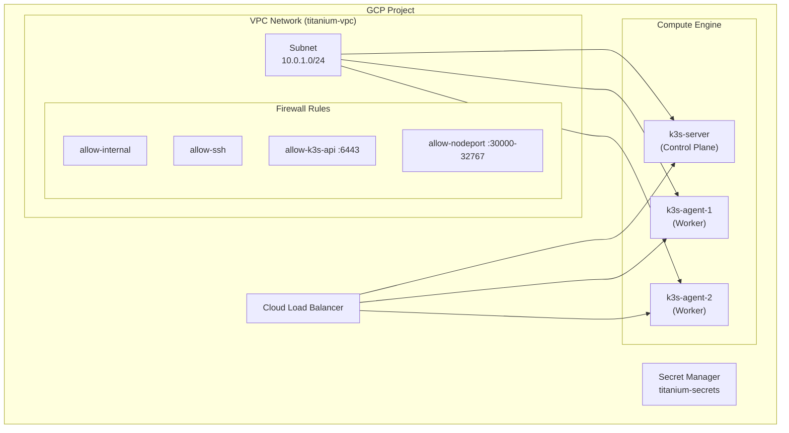
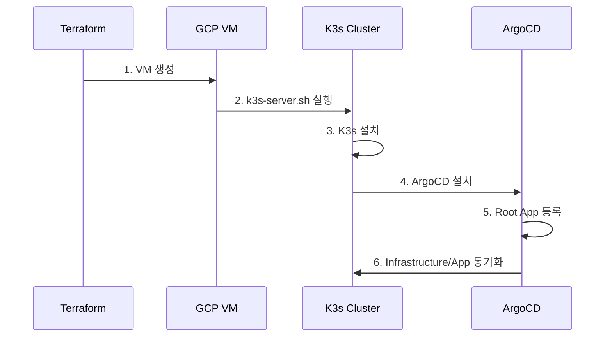
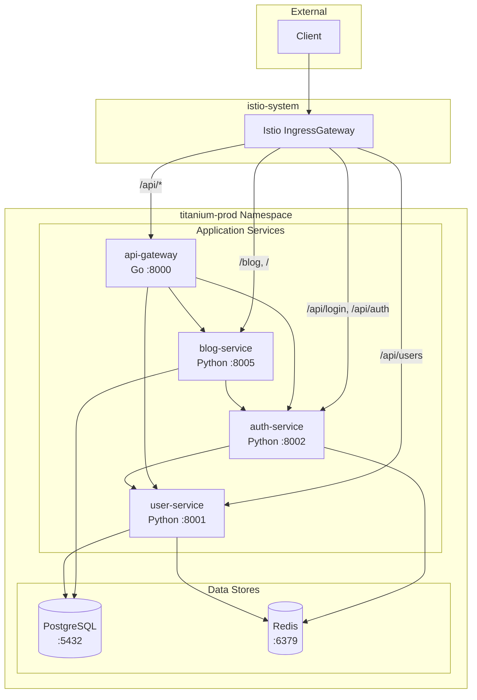
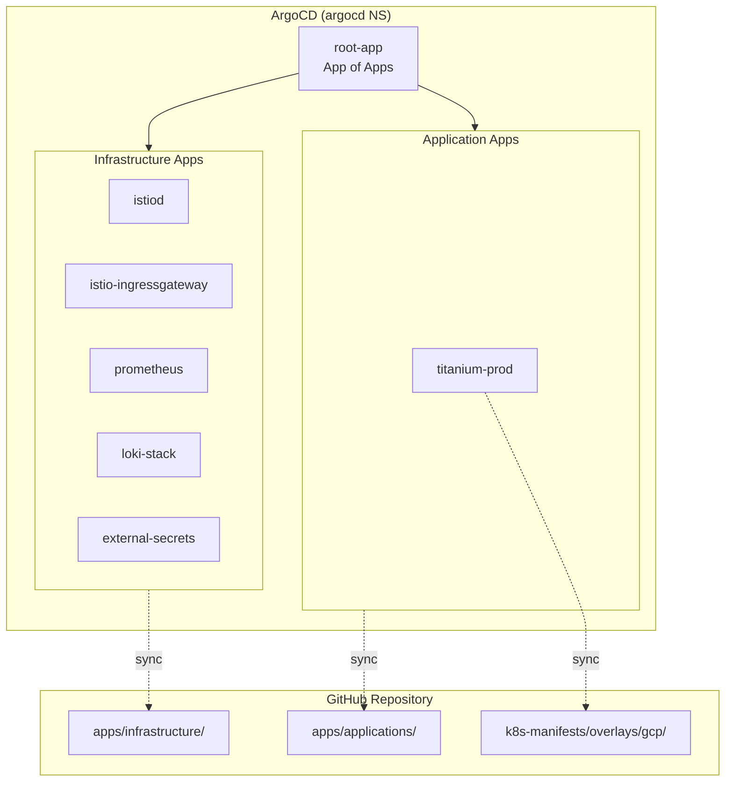
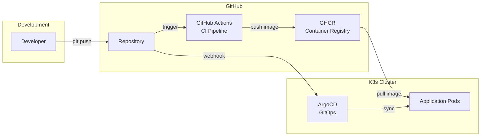
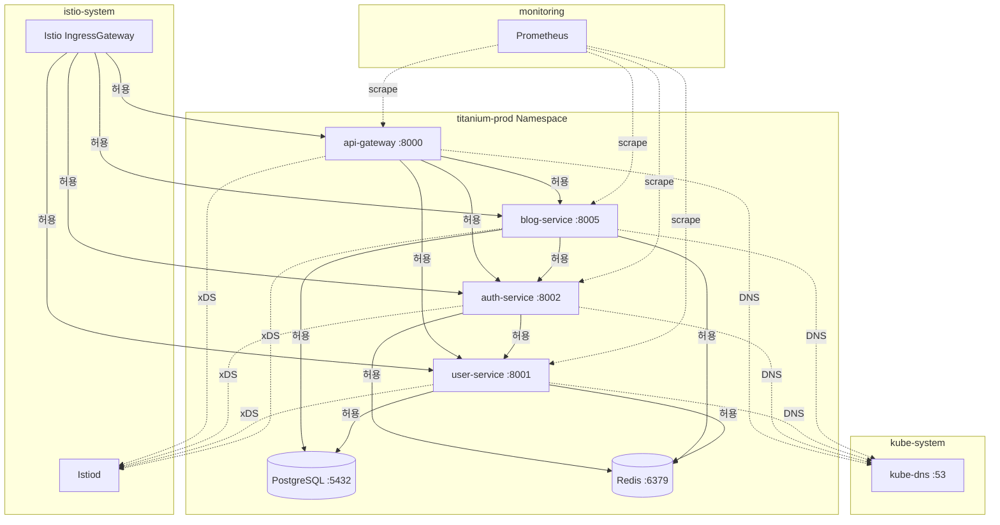
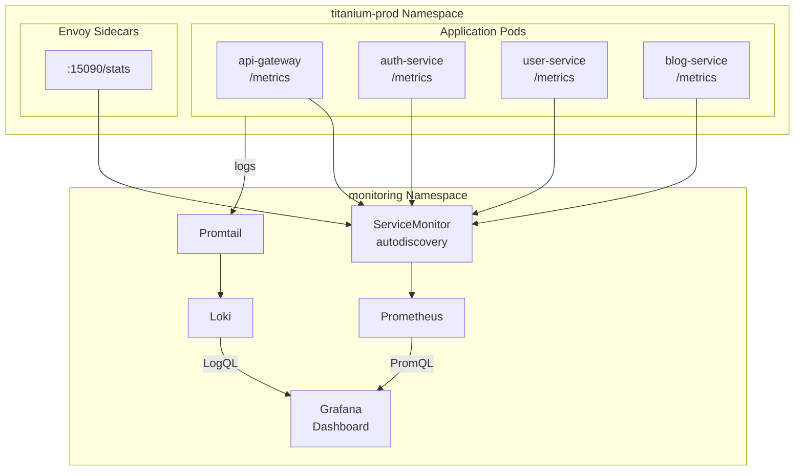
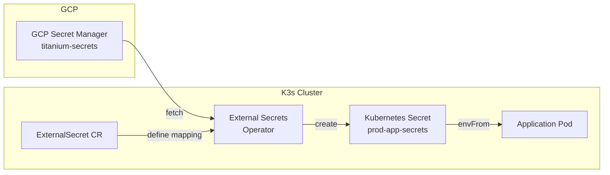
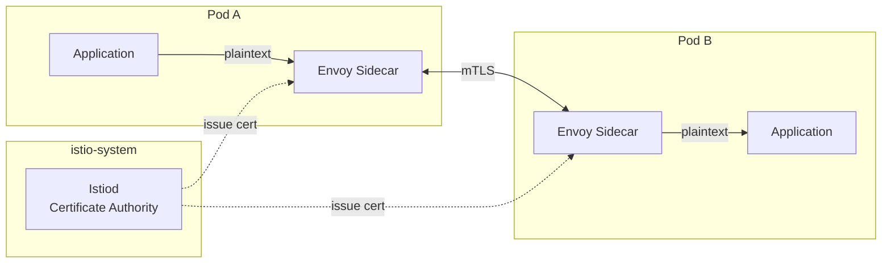

# Titanium Monitoring Platform Architecture

## 개요

Titanium은 GCP 기반 Kubernetes(K3s) 환경에서 운영되는 Microservice 기반 Monitoring Platform이다. Infrastructure as Code(Terraform), GitOps(ArgoCD), Service Mesh(Istio)를 통해 End-to-End 자동화를 구현한다.

## 기술 스택

| 계층 | 기술 |
|------|------|
| Cloud Provider | Google Cloud Platform (GCP) |
| Kubernetes | K3s v1.31 |
| IaC | Terraform |
| GitOps | ArgoCD v3.2.3 |
| Service Mesh | Istio v1.24.2 |
| Monitoring | Prometheus + Loki + Grafana |
| Secret Management | External Secrets Operator + GCP Secret Manager |
| Container Registry | GitHub Container Registry (ghcr.io) |
| CI/CD | GitHub Actions |

---

## 시스템 아키텍처



---

## Infrastructure 아키텍처

### GCP 리소스 구성



### K3s Cluster 구성

| 노드 역할 | 스펙 | 수량 |
|----------|------|------|
| Server (Control Plane) | e2-medium (2 vCPU, 4GB) | 1 |
| Agent (Worker) | e2-medium (2 vCPU, 4GB) | 2 |

### Bootstrap 자동화 흐름



---

## Application 아키텍처

### Microservice 구성



### Service 상세

| Service | 기술 | 포트 | 역할 |
|---------|------|------|------|
| api-gateway | Go (Gin) | 8000 | API 라우팅, Rate Limiting |
| auth-service | Python (FastAPI) | 8002 | JWT 인증, 로그인 |
| user-service | Python (FastAPI) | 8001 | 사용자 CRUD |
| blog-service | Python (FastAPI) | 8005 | 블로그 CRUD, 프론트엔드 |
| postgresql | PostgreSQL 15 | 5432 | 영구 데이터 저장 |
| redis | Redis 7 | 6379 | JWT Token 캐싱 |

### Istio 라우팅 (VirtualService)

| 경로 | 대상 Service |
|------|-------------|
| `/blog/*` | blog-service:8005 |
| `/api/users/*` | user-service:8001 |
| `/api/login` | auth-service:8002 |
| `/api/auth/*` | auth-service:8002 |
| `/api/*` (fallback) | api-gateway:8000 |
| `/` | blog-service:8005 |

---

## GitOps 배포 아키텍처

### App of Apps 패턴



### 디렉토리 구조

```
Monitoring-v3/
├── apps/                          # ArgoCD Application 정의
│   ├── root-app.yaml              # Root Application (진입점)
│   ├── infrastructure/            # Infrastructure Apps
│   │   ├── argocd.yaml
│   │   ├── istiod.yaml
│   │   ├── istio-ingressgateway.yaml
│   │   ├── prometheus.yaml
│   │   ├── loki-stack.yaml
│   │   └── external-secrets.yaml
│   └── applications/              # Application Apps
│       └── titanium-prod.yaml
├── k8s-manifests/                 # Kubernetes 리소스 정의
│   ├── base/                      # 공통 리소스
│   └── overlays/
│       └── gcp/                   # GCP 환경 Overlay
└── terraform/                     # Infrastructure as Code
    └── environments/
        └── gcp/
```

### CI/CD 파이프라인



---

## 네트워크 아키텍처

### Zero Trust NetworkPolicy

모든 Pod에 기본 Deny 정책 적용 후, 필요한 통신만 명시적 허용.



### 허용된 통신 경로

| Source | Destination | Port | 용도 |
|--------|-------------|------|------|
| istio-ingressgateway | api-gateway | 8000 | 외부 트래픽 |
| istio-ingressgateway | *-service | 800* | 직접 라우팅 |
| api-gateway | auth/user/blog-service | 800* | API 프록시 |
| auth-service | user-service | 8001 | 사용자 조회 |
| auth-service | redis | 6379 | JWT 저장 |
| user/blog-service | postgresql | 5432 | 데이터 저장 |
| 모든 Pod | kube-dns | 53/UDP | DNS 조회 |
| 모든 Pod | istiod | 15012, 15010 | Istio Control Plane |

---

## 관측성 (Observability)

### Monitoring Stack



### 수집 메트릭

| 메트릭 유형 | 소스 | 용도 |
|------------|------|------|
| Application Metrics | ServiceMonitor | 요청 수, 응답 시간, 에러율 |
| Istio Metrics | Envoy Sidecar (15090) | Service Mesh 트래픽 |
| Kubernetes Metrics | kube-state-metrics | Pod/Node 상태 |
| Node Metrics | node-exporter | CPU, Memory, Disk |
| Application Logs | Promtail | 중앙 집중 로그 |

---

## 보안 아키텍처

### 계층별 보안

| 계층 | 보안 메커니즘 |
|------|-------------|
| Network | GCP Firewall, Kubernetes NetworkPolicy |
| Transport | Istio mTLS (STRICT mode) |
| Authentication | JWT (auth-service) |
| Secret Management | External Secrets + GCP Secret Manager |
| Container | Non-root user, Read-only filesystem |

### Secret 관리 흐름



### mTLS 통신



---

## 관련 문서

- [ADR 목록](adr/README.md): Architecture Decision Records
- [IaC 트러블슈팅](../IaC-TROUBLESHOOTING.md): Infrastructure 문제 해결
- [트러블슈팅](../TROUBLESHOOTING.md): 일반 문제 해결
- [Secret 관리](../secret-management.md): Secret 관리 가이드
