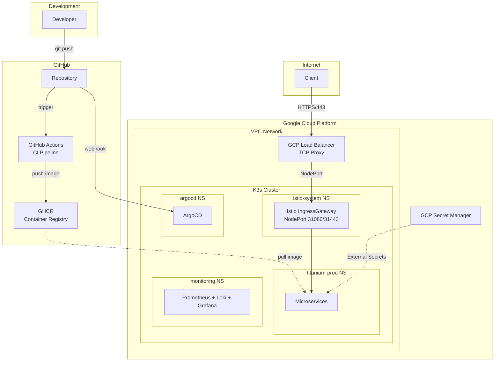
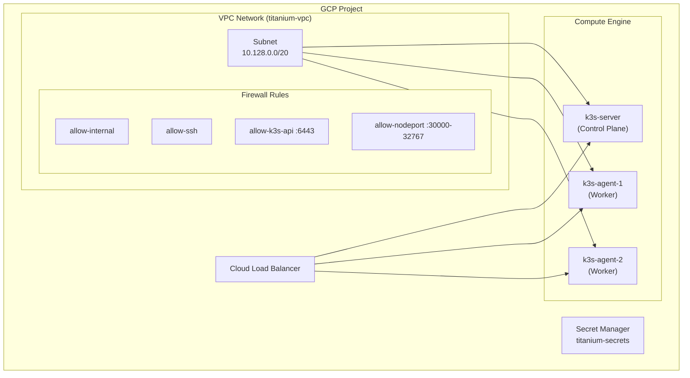
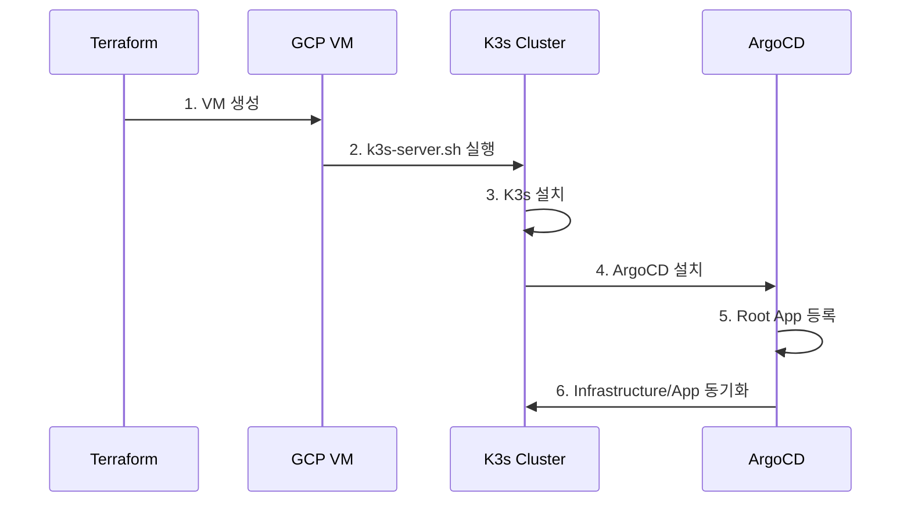
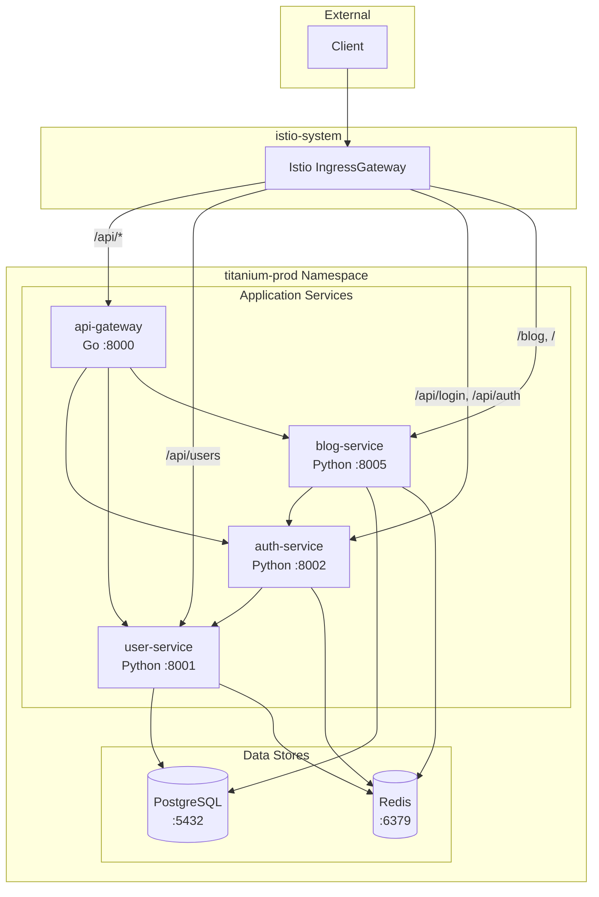
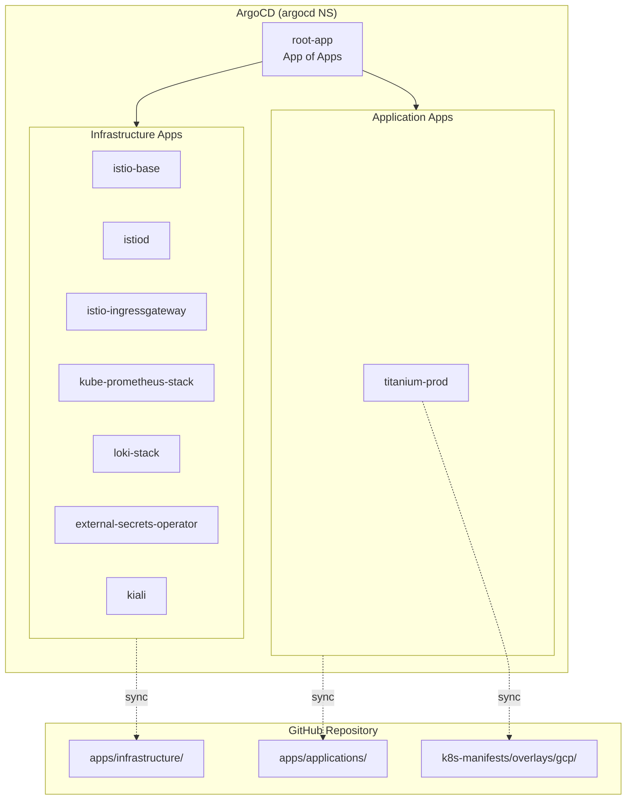
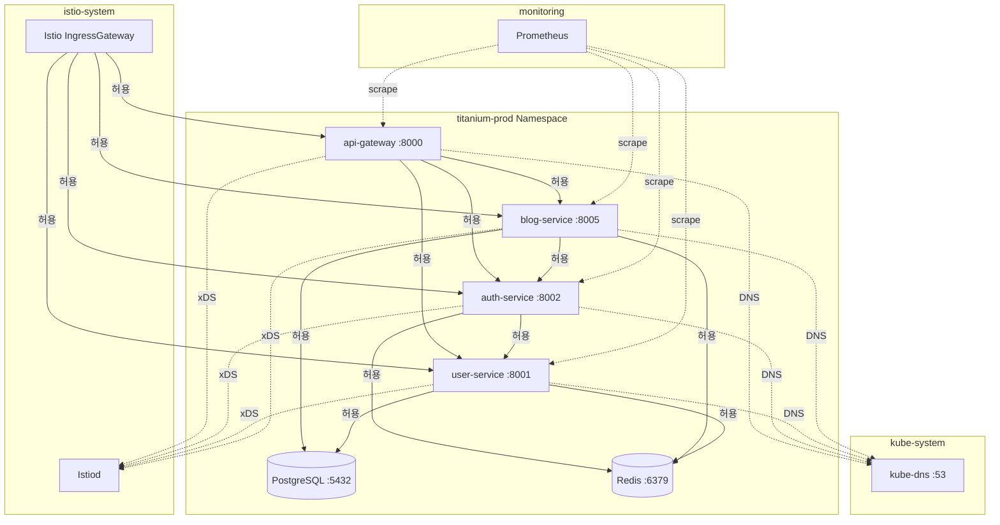
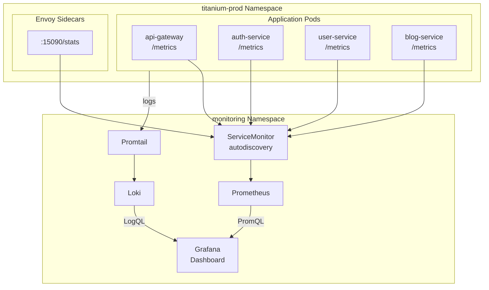
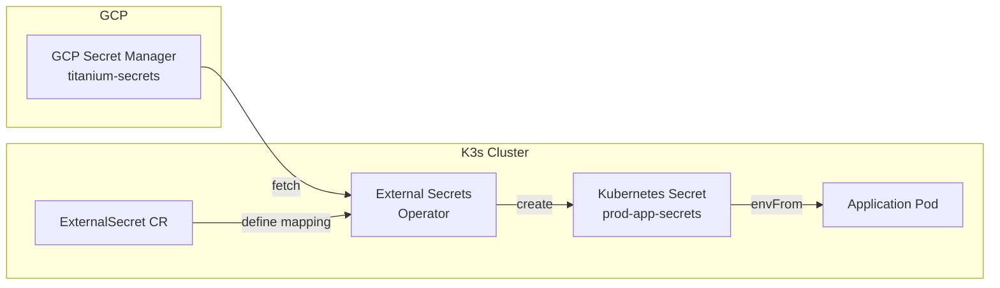
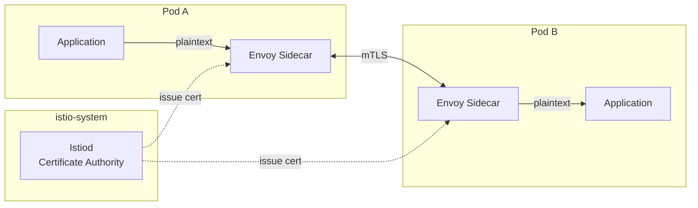
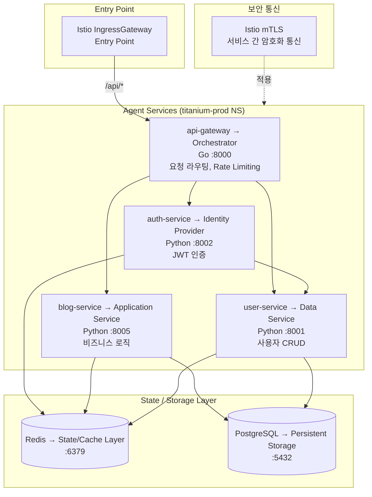

# Titanium Monitoring Platform Architecture

## 개요

Titanium은 GCP 기반 Kubernetes(K3s) 환경에서 운영되는 Microservice 기반 Monitoring Platform이다. Infrastructure as Code(Terraform), GitOps(ArgoCD), Service Mesh(Istio)를 통해 인프라 프로비저닝부터 애플리케이션 배포까지 자동화를 구현한다.

## 기술 스택

| 계층 | 기술 |
|------|------|
| Cloud Provider | Google Cloud Platform (GCP) |
| Kubernetes | K3s v1.31.4+k3s1 |
| IaC | Terraform |
| GitOps | ArgoCD v3.2.3 |
| Service Mesh | Istio v1.24.2 |
| Monitoring | Prometheus + Loki + Grafana |
| Secret Management | External Secrets Operator + GCP Secret Manager |
| Container Registry | GitHub Container Registry (ghcr.io) |
| CI/CD | GitHub Actions |

---

## 시스템 아키텍처


```mermaid
flowchart TB
    subgraph Dev["Development"]
        Developer[Developer]
    end

    subgraph GitHub["GitHub"]
        Repo[Repository]
        Actions[GitHub Actions<br/>CI Pipeline]
        GHCR[GHCR<br/>Container Registry]
    end

    subgraph Internet
        Client[Client]
    end

    subgraph GCP["Google Cloud Platform"]
        subgraph VPC["VPC Network"]
            LB[GCP Load Balancer<br/>TCP Proxy]

            subgraph K3s["K3s Cluster"]
                subgraph istio-system["istio-system NS"]
                    IGW[Istio IngressGateway<br/>NodePort 31080/31443]
                end

                subgraph titanium-prod["titanium-prod NS"]
                    Services[Microservices]
                end

                subgraph monitoring["monitoring NS"]
                    Mon[Prometheus + Loki + Grafana]
                end

                subgraph argocd-ns["argocd NS"]
                    ArgoCD[ArgoCD]
                end
            end
        end

        SM[GCP Secret Manager]
    end

    %% CI Flow
    Developer -->|git push| Repo
    Repo -->|trigger| Actions
    Actions -->|push image| GHCR

    %% CD Flow
    Repo -->|webhook| ArgoCD
    GHCR -.->|pull image| Services

    %% Request Flow
    Client -->|HTTPS/443| LB
    LB -->|NodePort| IGW
    IGW --> Services
    SM -.->|External Secrets| Services
```

---

## Infrastructure 아키텍처

### GCP 리소스 구성


```mermaid
flowchart TB
    subgraph GCP["GCP Project"]
        subgraph VPC["VPC Network (titanium-vpc)"]
            Subnet["Subnet<br/>10.128.0.0/20"]

            subgraph FW["Firewall Rules"]
                FW1[allow-internal]
                FW2[allow-ssh]
                FW3[allow-k3s-api :6443]
                FW4[allow-nodeport :30000-32767]
            end
        end

        subgraph Compute["Compute Engine"]
            Server["k3s-server<br/>(Control Plane)"]
            Agent1["k3s-agent-1<br/>(Worker)"]
            Agent2["k3s-agent-2<br/>(Worker)"]
        end

        LB["Cloud Load Balancer"]
        SM["Secret Manager<br/>titanium-secrets"]
    end

    Subnet --> Server
    Subnet --> Agent1
    Subnet --> Agent2
    LB --> Server
    LB --> Agent1
    LB --> Agent2
```

### K3s Cluster 구성

| 노드 역할 | 스펙 | 수량 |
|----------|------|------|
| Server (Control Plane) | e2-medium (2 vCPU, 4GB) | 1 |
| Agent (Worker) | e2-standard-2 (2 vCPU, 8GB) | 2 |

### Bootstrap 자동화 흐름


```mermaid
sequenceDiagram
    participant TF as Terraform
    participant VM as GCP VM
    participant K3s as K3s Cluster
    participant Argo as ArgoCD

    TF->>VM: 1. VM 생성
    VM->>K3s: 2. k3s-server.sh 실행
    K3s->>K3s: 3. K3s 설치
    K3s->>Argo: 4. ArgoCD 설치
    Argo->>Argo: 5. Root App 등록
    Argo->>K3s: 6. Infrastructure/App 동기화
```

---

## Application 아키텍처

### Microservice 구성


```mermaid
flowchart TB
    subgraph External
        Client[Client]
    end

    subgraph istio-system
        IGW[Istio IngressGateway]
    end

    subgraph titanium-prod["titanium-prod Namespace"]
        subgraph Services["Application Services"]
            API[api-gateway<br/>Go :8000]
            Auth[auth-service<br/>Python :8002]
            User[user-service<br/>Python :8001]
            Blog[blog-service<br/>Python :8005]
        end

        subgraph Data["Data Stores"]
            PG[(PostgreSQL<br/>:5432)]
            Redis[(Redis<br/>:6379)]
        end
    end

    Client --> IGW
    IGW -->|/api/*| API
    IGW -->|/api/users| User
    IGW -->|/api/login, /api/auth| Auth
    IGW -->|/blog, /| Blog

    API --> Auth
    API --> User
    API --> Blog

    Auth --> User
    Auth --> Redis
    Blog --> Auth
    Blog --> PG
    Blog --> Redis
    User --> PG
    User --> Redis
```

### Service 상세

| Service | 기술 | 포트 | 역할 |
|---------|------|------|------|
| api-gateway | Go (net/http) | 8000 | API 라우팅, Rate Limiting |
| auth-service | Python (FastAPI) | 8002 | JWT 인증, 로그인 |
| user-service | Python (FastAPI) | 8001 | 사용자 CRUD |
| blog-service | Python (FastAPI) | 8005 | 블로그 CRUD, 프론트엔드 |
| postgresql | PostgreSQL 15 | 5432 | 영구 데이터 저장 |
| redis | Redis 7 | 6379 | JWT Token 캐싱 |

### Istio 라우팅 (VirtualService)

| 경로 | 대상 Service | Rewrite |
|------|-------------|---------|
| `/blog/*` | blog-service:8005 | - |
| `/api/users/health` | user-service:8001 | `/health` |
| `/api/users/*` | user-service:8001 | `/users` |
| `/api/login` | auth-service:8002 | `/login` |
| `/api/auth/health` | auth-service:8002 | `/health` |
| `/api/auth/*` | auth-service:8002 | `/` |
| `/api/*` (fallback) | api-gateway:8000 | - |
| `/` | blog-service:8005 | - |

---

## GitOps 배포 아키텍처

### App of Apps 패턴


```mermaid
flowchart TB
    subgraph ArgoCD["ArgoCD (argocd NS)"]
        Root[root-app<br/>App of Apps]

        subgraph InfraApps["Infrastructure Apps"]
            IstioBase[istio-base]
            Istiod[istiod]
            Gateway[istio-ingressgateway]
            Prom[kube-prometheus-stack]
            Loki[loki-stack]
            ESO[external-secrets-operator]
            Kiali[kiali]
        end

        subgraph AppApps["Application Apps"]
            Titanium[titanium-prod]
        end
    end

    subgraph GitHub["GitHub Repository"]
        AppsInfra["apps/infrastructure/"]
        AppsApp["apps/applications/"]
        K8sManifests["k8s-manifests/overlays/gcp/"]
    end

    Root --> InfraApps
    Root --> AppApps

    InfraApps -.->|sync| AppsInfra
    AppApps -.->|sync| AppsApp
    Titanium -.->|sync| K8sManifests
```

### 디렉토리 구조

```
Monitoring-v3/
├── apps/                          # ArgoCD Application 정의
│   ├── root-app.yaml              # Root Application (진입점)
│   ├── infrastructure/            # Infrastructure Apps
│   │   ├── external-secrets-operator.yaml
│   │   ├── istio-base.yaml
│   │   ├── istio-ingressgateway.yaml
│   │   ├── istiod.yaml
│   │   ├── kiali.yaml
│   │   ├── kube-prometheus-stack.yaml
│   │   ├── kustomization.yaml
│   │   └── loki-stack.yaml
│   └── applications/              # Application Apps
│       └── titanium-prod.yaml
├── k8s-manifests/                 # Kubernetes 리소스 정의
│   ├── base/                      # 공통 리소스
│   └── overlays/
│       └── gcp/                   # GCP 환경 Overlay
└── terraform/                     # Infrastructure as Code
    └── environments/
        └── gcp/
```

### CI/CD 파이프라인

CI/CD 흐름은 상단 시스템 아키텍처 다이어그램에 통합되어 있다. 각 단계는 다음과 같다.

**CI (Continuous Integration)**

1. Developer가 코드를 변경하여 `git push`
2. GitHub Actions CI Pipeline이 자동 Trigger (Lint, Test, Build)
3. Container Image를 GHCR(GitHub Container Registry)에 Push

**CD (Continuous Deployment)**

1. Repository 변경 시 Webhook을 통해 ArgoCD에 알림
2. ArgoCD가 Git Repository의 Manifest와 Cluster 상태를 비교하여 자동 Sync
3. K3s Cluster 내 Pod가 GHCR에서 새 Image를 Pull하여 배포 완료

---

## 네트워크 아키텍처

### Zero Trust NetworkPolicy

모든 Pod에 기본 Deny 정책 적용 후, 필요한 통신만 명시적 허용.


```mermaid
flowchart TB
    subgraph istio-system
        IGW[Istio IngressGateway]
        Istiod[Istiod]
    end

    subgraph monitoring
        Prom[Prometheus]
    end

    subgraph kube-system
        DNS[kube-dns :53]
    end

    subgraph titanium-prod["titanium-prod Namespace"]
        API[api-gateway :8000]
        Auth[auth-service :8002]
        User[user-service :8001]
        Blog[blog-service :8005]
        PG[(PostgreSQL :5432)]
        Redis[(Redis :6379)]
    end

    IGW -->|허용| API
    IGW -->|허용| Auth
    IGW -->|허용| User
    IGW -->|허용| Blog

    API -->|허용| Auth
    API -->|허용| User
    API -->|허용| Blog

    Auth -->|허용| User
    Auth -->|허용| Redis

    Blog -->|허용| Auth
    Blog -->|허용| PG
    Blog -->|허용| Redis

    User -->|허용| PG
    User -->|허용| Redis

    Prom -.->|scrape| API
    Prom -.->|scrape| Auth
    Prom -.->|scrape| User
    Prom -.->|scrape| Blog

    API -.->|DNS| DNS
    Auth -.->|DNS| DNS
    User -.->|DNS| DNS
    Blog -.->|DNS| DNS

    API -.->|xDS| Istiod
    Auth -.->|xDS| Istiod
    User -.->|xDS| Istiod
    Blog -.->|xDS| Istiod
```

### 허용된 통신 경로

| Source | Destination | Port | 용도 |
|--------|-------------|------|------|
| istio-ingressgateway | api-gateway | 8000 | 외부 트래픽 |
| istio-ingressgateway | *-service | 800* | 직접 라우팅 |
| api-gateway | auth/user/blog-service | 800* | API 프록시 |
| auth-service | user-service | 8001 | 사용자 조회 |
| auth-service | redis | 6379 | JWT 저장 |
| blog-service | auth-service | 8002 | JWT 토큰 검증 |
| user-service | postgresql | 5432 | 데이터 저장 |
| blog-service | postgresql | 5432 | 데이터 저장 |
| user-service | redis | 6379 | 캐싱 |
| blog-service | redis | 6379 | 캐싱 |
| 모든 Pod | kube-dns | 53/UDP | DNS 조회 |
| 모든 Pod | istiod | 15012, 15010 | Istio Control Plane |

---

## 관측성 (Observability)

### Monitoring Stack


```mermaid
flowchart TB
    subgraph titanium-prod["titanium-prod Namespace"]
        subgraph Pods["Application Pods"]
            App1[api-gateway<br/>/metrics]
            App2[auth-service<br/>/metrics]
            App3[user-service<br/>/metrics]
            App4[blog-service<br/>/metrics]
        end

        subgraph Sidecars["Envoy Sidecars"]
            Envoy[:15090/stats]
        end
    end

    subgraph monitoring["monitoring Namespace"]
        SM[ServiceMonitor<br/>autodiscovery]
        Prom[Prometheus]
        Loki[Loki]
        Promtail[Promtail]
        Grafana[Grafana<br/>Dashboard]
    end

    App1 --> SM
    App2 --> SM
    App3 --> SM
    App4 --> SM
    Envoy --> SM
    SM --> Prom

    Pods -->|logs| Promtail
    Promtail --> Loki

    Prom -->|PromQL| Grafana
    Loki -->|LogQL| Grafana
```

### 수집 메트릭

| 메트릭 유형 | 소스 | 용도 |
|------------|------|------|
| Application Metrics | ServiceMonitor | 요청 수, 응답 시간, 에러율 |
| Istio Metrics | Envoy Sidecar (15090) | Service Mesh 트래픽 |
| Kubernetes Metrics | kube-state-metrics | Pod/Node 상태 |
| Node Metrics | node-exporter | CPU, Memory, Disk |
| Application Logs | Promtail | 중앙 집중 로그 |

---

## 보안 아키텍처

### 계층별 보안

| 계층 | 보안 메커니즘 |
|------|-------------|
| Network | GCP Firewall, Kubernetes NetworkPolicy |
| Transport | Istio mTLS (STRICT mode) |
| Authentication | JWT (auth-service) |
| Secret Management | External Secrets + GCP Secret Manager |
| Container | Non-root user, Read-only filesystem |

### Secret 관리 흐름


```mermaid
flowchart LR
    subgraph GCP
        SM[GCP Secret Manager<br/>titanium-secrets]
    end

    subgraph K3s["K3s Cluster"]
        ESO[External Secrets<br/>Operator]
        ES[ExternalSecret CR]
        Secret[Kubernetes Secret<br/>prod-app-secrets]
        Pod[Application Pod]
    end

    SM -->|fetch| ESO
    ES -->|define mapping| ESO
    ESO -->|create| Secret
    Secret -->|envFrom| Pod
```

### mTLS 통신


```mermaid
flowchart LR
    subgraph Pod1["Pod A"]
        App1[Application]
        Envoy1[Envoy Sidecar]
    end

    subgraph Pod2["Pod B"]
        Envoy2[Envoy Sidecar]
        App2[Application]
    end

    subgraph istio-system
        Istiod[Istiod<br/>Certificate Authority]
    end

    App1 -->|plaintext| Envoy1
    Envoy1 <-->|mTLS| Envoy2
    Envoy2 -->|plaintext| App2

    Istiod -.->|issue cert| Envoy1
    Istiod -.->|issue cert| Envoy2
```

---

## AI Agent 관점 아키텍처

본 프로젝트의 마이크로서비스 구조는 AI Agent 시스템의 구조와 유사성을 가진다.
아래는 기존 구현을 AI Agent 관점에서 재라벨링한 다이어그램이다. 실제 AI Agent를 구현한 것이 아닌, 구조적 유사성을 나타낸다.


```mermaid
flowchart TB
    subgraph Entry["Entry Point"]
        IGW[Istio IngressGateway<br/>Entry Point]
    end

    subgraph AgentLayer["Agent Services (titanium-prod NS)"]
        Orchestrator[api-gateway → Orchestrator<br/>Go :8000<br/>요청 라우팅, Rate Limiting]
        Identity[auth-service → Identity Provider<br/>Python :8002<br/>JWT 인증]
        DataSvc[user-service → Data Service<br/>Python :8001<br/>사용자 CRUD]
        AppSvc[blog-service → Application Service<br/>Python :8005<br/>비즈니스 로직]
    end

    subgraph StateLayer["State / Storage Layer"]
        Redis[(Redis → State/Cache Layer<br/>:6379)]
        PG[(PostgreSQL → Persistent Storage<br/>:5432)]
    end

    subgraph Security["보안 통신"]
        mTLS[Istio mTLS<br/>서비스 간 암호화 통신]
    end

    IGW -->|/api/*| Orchestrator
    Orchestrator --> Identity
    Orchestrator --> DataSvc
    Orchestrator --> AppSvc

    Identity --> Redis
    Identity --> DataSvc
    AppSvc --> PG
    AppSvc --> Redis
    DataSvc --> PG
    DataSvc --> Redis

    mTLS -.->|적용| AgentLayer
```

### 구조적 유사성

| 현재 구현 | AI Agent 시스템 대응 | 유사성 |
|-----------|-------------------|--------|
| api-gateway (라우팅) | Orchestrator Agent (작업 분배) | 요청을 적절한 서비스로 라우팅 |
| auth-service (JWT) | Agent Identity/Auth | 서비스 인증 및 권한 관리 |
| Redis (캐싱) | Agent State/Memory | 상태 저장 및 조회 |
| Istio mTLS | Agent 간 보안 통신 | Zero Trust 기반 서비스 간 통신 |
| ArgoCD (GitOps) | Agent 배포 자동화 | 선언적 서비스 추가/업데이트 |
| Prometheus (메트릭) | Agent Observability | 서비스 상태 및 성능 모니터링 |

---

## 인프라 기술 — AI Agent 영역 대응 관계

본 프로젝트에서 구현한 인프라 기술과 AI Agent 영역의 대응 관계를 정리한다.

| 인프라 역량 (구현 완료) | AI Agent 확장 가능 영역 | 기술적 근거 |
|----------------------|----------------------|-------------|
| K3s Cluster 운영 | LLM 추론 서버 배포 | vLLM, KServe는 Kubernetes 기반 배포 |
| Terraform IaC | AI 인프라 자동 프로비저닝 | GPU 클러스터도 Terraform으로 관리 가능 |
| Prometheus + Grafana | LLM 메트릭 모니터링 | Grafana LLM Plugin, OpenTelemetry GenAI SIG |
| Loki 로그 수집 | 프롬프트/응답 트레이싱 | 중앙 집중 로그 파이프라인 구조 동일 |
| Istio mTLS | Multi-Agent 보안 통신 | Zero Trust 네트워크 정책으로 서비스 간 통신 제어 |
| ArgoCD App of Apps | ML/LLM 모델 선언적 배포 | App of Apps 패턴에서 YAML 추가로 새 서비스 배포 구조 |
| External Secrets + GCP SM | LLM API Key 보안 관리 | Secret 자동 동기화 구조 동일 |
| NetworkPolicy (Zero Trust) | Agent 간 접근 제어 | Default Deny + Explicit Allow 패턴 |
| GitHub Actions CI | ML/LLM CI 파이프라인 | 모델 테스트, 이미지 빌드, 취약점 스캔 |
| Microservice Architecture | Multi-Agent Architecture | 독립 배포, 스케일링, 장애 격리 |

---

## 관련 문서

- [ADR 목록](adr/README.md): Architecture Decision Records
- [Troubleshooting](../TROUBLESHOOTING.md): IaC 배포 및 테스트 문제 해결
- [Secret 관리](../secret-management.md): Secret 관리 가이드
