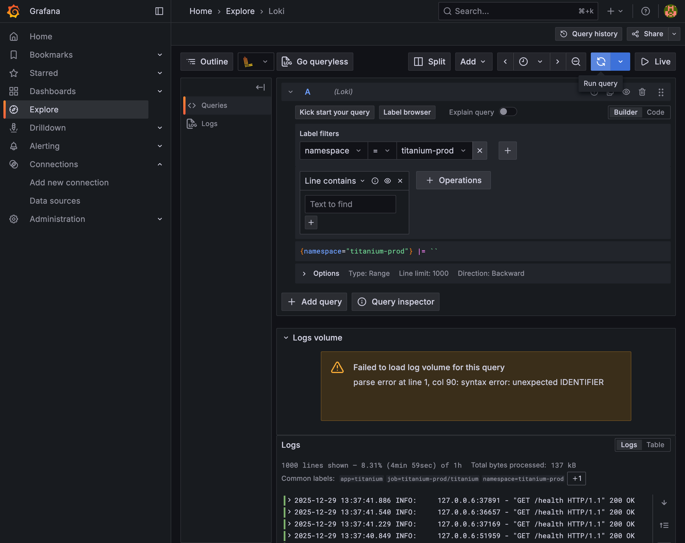

# Monitoring Dashboard Test Report

**Test Date**: 2025-12-29
**Environment**: GCP Kubernetes Cluster (titanium-k3s)
**Branch**: feature/gcp-configuration

---

## Test Summary

| Dashboard | Status | Notes |
|-----------|--------|-------|
| Prometheus | PASS | 25 targets UP, Istio metrics 수집 정상 |
| Grafana | PASS | titanium-prod namespace 데이터 표시 정상 |
| Kiali | PASS | Service mesh topology 시각화 정상 |
| Loki | PASS | titanium-prod namespace 로그 수집 정상 (137 kB) |

---

## 1. Cluster Information

### Node Status
```
NAME                    STATUS   ROLES                  INTERNAL-IP   EXTERNAL-IP
titanium-k3s-master     Ready    control-plane,master   10.128.0.2    34.64.202.254
titanium-k3s-worker-1   Ready    <none>                 10.128.0.3    34.22.77.144
```

**Note**: Worker node 장애 발생 후 GCP VM 재시작으로 복구 완료

### Access URLs
| Service | URL |
|---------|-----|
| Prometheus | `http://34.64.202.254:31090` |
| Grafana | `http://34.64.202.254:31300` |
| Kiali | `http://34.64.202.254:31200` |

---

## 2. Prometheus Dashboard Test

### Targets Status
- **Total Targets**: 25 UP, 0 DOWN
- **Istio Metrics**: istiod-monitor, envoy-stats-monitor 정상 수집
- **Application Metrics**: Envoy proxy metrics 사용 (mTLS STRICT 환경)

### Screenshot


---

## 3. Grafana Dashboard Test

### Kubernetes Namespace Dashboard
- **Dashboard**: Kubernetes / Compute Resources / Namespace (Pods)
- **Namespace**: titanium-prod
- **Data Displayed**:
  - Memory Utilisation (from requests): 17.4%
  - Memory Utilisation (from limits): 6.80%
  - Pod별 CPU/Memory 사용량 테이블

### Screenshot


---

## 4. Kiali Service Mesh Test

### Service Graph
- **Namespace**: titanium-prod
- **Applications**: 6 apps (6 versions)
- **Services**: 6 services
- **mTLS Status**: Enabled

### Screenshot


---

## 5. Loki Log Query Test

### Status
- **Data Source**: Loki
- **Query**: `{namespace="titanium-prod"}`
- **Result**: 로그 수집 정상
  - Lines shown: 1000 (8.31% of 1h)
  - Total bytes processed: 137 kB
  - Common labels: `app=titanium`, `namespace=titanium-prod`

### Screenshot


---

## Issues Encountered

### Worker Node Failure
- **Issue**: `titanium-k3s-worker-1` node가 NotReady 상태로 전환
- **Impact**: Worker node에 배포된 Pod들(Grafana, Prometheus, Loki, Kiali)이 Terminating 상태
- **Resolution**:
  - PVC 삭제 후 Master node에서 Pod 재스케줄링
  - Prometheus, Grafana, Kiali 정상 복구
  - Loki 재시작 후 로그 수집 재개 대기

---

## Test Conclusion

Monitoring Stack(Prometheus, Grafana, Kiali, Loki) 전체가 정상 동작함을 확인했습니다. Worker node 장애 발생 시 GCP VM 재시작을 통해 복구할 수 있었으며, 모든 서비스가 정상화되었습니다.

### Final Status
- **Prometheus**: 25 targets UP
- **Grafana**: titanium-prod namespace 메트릭 시각화 정상
- **Kiali**: Service mesh topology 정상
- **Loki**: 로그 수집 및 조회 정상
