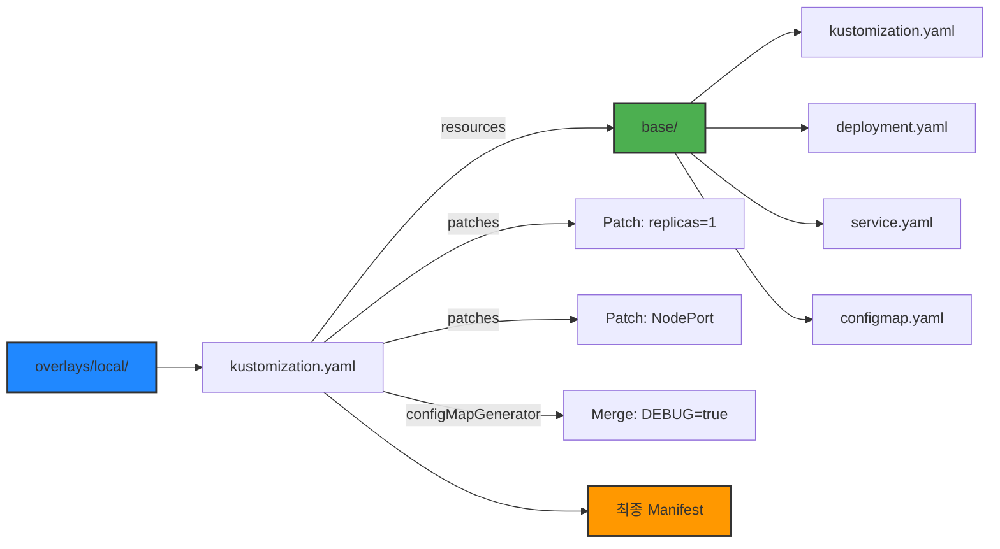

# Kubernetes Manifests (k8s-manifests)

## 1. 개요
- **Kubernetes 배포 정의**: 이 디렉터리는 전체 Microservice 애플리케이션을 Kubernetes Cluster에 배포하기 위한 모든 매니페스트(YAML 설정 파일)를 포함하고 있음
- **Kustomize 기반 구성 관리**: Kubernetes 설정을 효율적으로 관리하기 위해 **Kustomize**를 사용함. 이를 통해 공통 설정과 환경별 설정을 분리하여 유지보수성과 재사용성을 높임 
- **Base + Overlays 구조**:
    - `base/`: 모든 환경(개발, 스테이징, 운영)에서 공통으로 사용되는 핵심 리소스(Deployment, Service 등)의 템플릿을 정의
    - `overlays/`: `local`과 같은 특정 환경에만 적용될 변경사항이나 추가 설정을 정의

## 2. 핵심 기능 및 책임
- **선언적 인프라 관리**: 모든 애플리케이션 구성 요소를 YAML 파일 코드로 정의하여, 인프라를 버전 관리하고 일관성 있으며 반복 가능한 배포를 가능하게 함
- **환경 분리 및 관리**: `base`에 정의된 공통 설정을 바탕으로, `overlays/local`에서는 로컬 개발 환경에 맞게 복제본 수(replicas), 서비스 타입(`NodePort`), 환경 변수 등을 덮어쓰거나 변경함 
- **중앙화된 설정 주입**: `ConfigMap`과 `Secret`을 통해 모든 Microservice가 사용할 환경 변수(서비스 URL, DB 접속 정보, 비밀 키 등)를 중앙에서 관리하고 각 Pod에 주입함 
- **데이터 영속성 및 자동화**: `PersistentVolumeClaim`을 통해 `user-service`의 데이터베이스를 Pod의 생명주기와 무관하게 영속적으로 보존하고, `CronJob`을 통해 DB 백업과 같은 주기적인 작업을 자동화함

## 3. 기술적 구현 (Kustomize)

이 프로젝트는 Kustomize의 계층적 구조를 활용하여 설정을 효율적으로 관리합니다.

### Kustomize Base + Overlays 구조



**동작 방식:**
1. **base/**: 모든 환경에 공통적으로 적용되는 기본 설정을 정의
2. **overlays/local**: base의 설정을 상속받아 로컬 환경에 맞게 수정 (replicas, service type, ConfigMap 등)
3. **kustomize build**: base와 overlay를 병합하여 최종 매니페스트 생성

### 3.1. `base` 디렉터리 (공통 리소스 정의)
`base/kustomization.yaml` 파일은 애플리케이션을 구성하는 모든 기본 리소스 목록을 정의함.

- **`*-deployment.yaml`**: 각 Service의 Pod를 어떻게 실행할지 정의 (사용할 Container 이미지, 기본 복제본 수, 리소스 요구량/한도, Liveness/Readiness Probe 등)
- **`*-service.yaml`**: Deployment에 의해 실행된 Pod들에 안정적인 네트워크 주소(`ClusterIP`)를 부여하여 Service 간 통신을 가능하게 함
- **`configmap.yaml` & `secret.yaml`**: 애플리케이션의 설정과 비밀 정보를 관리
- **`user-service-pvc.yaml`**: `user-service`가 사용할 영구 저장 공간을 요청
- **`user-service-backup-cronjob.yaml`**: 매일 자정(UTC)에 `user-service`의 DB를 백업하는 `CronJob`을 정의

### 3.2. `overlays/local` 디렉터리 (로컬 환경 맞춤 설정)
`overlays/local/kustomization.yaml` 파일은 `base`의 설정을 상속받아 로컬 개발 환경에 맞게 **변경(Patch)**함.

- **`namePrefix: local-`**: `base`에 정의된 모든 리소스의 이름 앞에 `local-` 접두사를 붙여, 다른 환경의 리소스와 충돌하지 않도록 함
- **`namespace: titanium-local`**: 모든 리소스를 `titanium-local`이라는 별도의 Namespace에 배포하여 격리함 
- **`replicas`**: 모든 `Deployment`의 복제본(Pod) 수를 `1`로 재정의하여 로컬 환경의 리소스 사용량을 최소화함
- **`configMapGenerator`**: `base`의 `ConfigMap`에 로컬 환경용 변수(`ENVIRONMENT=local`, `DEBUG_MODE=true` 등)를 추가(merge)함
- **`patches`**:
    - `load-balancer-service`의 타입을 `ClusterIP`에서 **`NodePort`**로 변경하여, 로컬 머신의 특정 포트(30700)를 통해 외부에서 직접 접근할 수 있도록 함
    - 모든 `Deployment`의 `imagePullPolicy`를 **`IfNotPresent`**로 변경하여, 이미지가 로컬에 있을 경우 다시 내려받지 않도록 해 개발 속도를 향상시킴

### 3.3. Kustomize 빌드 결과 비교

`base`와 `overlays/local`을 빌드했을 때, 설정이 어떻게 변경되는지 비교합니다:

#### base의 api-gateway Deployment
```yaml
# base/api-gateway-deployment.yaml
apiVersion: apps/v1
kind: Deployment
metadata:
  name: api-gateway
spec:
  replicas: 3  # 프로덕션 기본값
  template:
    spec:
      containers:
      - name: api-gateway
        imagePullPolicy: Always  # 항상 최신 이미지 Pull
```

#### overlays/local에서 빌드한 결과
```bash
# kustomize build overlays/local | grep -A 10 "kind: Deployment"
apiVersion: apps/v1
kind: Deployment
metadata:
  name: local-api-gateway  # namePrefix 적용
  namespace: titanium-local  # namespace 지정
spec:
  replicas: 1  # 로컬 환경용으로 축소
  template:
    spec:
      containers:
      - name: api-gateway
        imagePullPolicy: IfNotPresent  # 로컬 캐시 사용
```

#### load-balancer Service 타입 변경
```yaml
# base/load-balancer-service.yaml
apiVersion: v1
kind: Service
metadata:
  name: load-balancer-service
spec:
  type: ClusterIP  # Cluster 내부에서만 접근 가능
```

```yaml
# kustomize build overlays/local (결과)
apiVersion: v1
kind: Service
metadata:
  name: local-load-balancer-service
  namespace: titanium-local
spec:
  type: NodePort  # 외부에서 접근 가능
  ports:
  - port: 80
    nodePort: 30700  # 고정 포트
```

**주요 변경 사항:**
- **replicas**: 3 → 1 (로컬 리소스 절약)
- **namePrefix**: api-gateway → local-api-gateway (환경 구분)
- **namespace**: default → titanium-local (격리)
- **service type**: ClusterIP → NodePort (외부 접근)
- **imagePullPolicy**: Always → IfNotPresent (빠른 개발)

## 4. 배포 방법
- 이 프로젝트의 Kubernetes 배포는 **Skaffold**를 통해 자동화됨
- 프로젝트 루트의 `skaffold.yaml` 파일 내 `manifests` 섹션에 배포 진입점으로 `k8s-manifests/overlays/local`이 지정되어 있음
- 터미널에서 `skaffold dev` 명령을 실행하면, Skaffold는 Kustomize를 사용하여 `local` 환경에 맞는 최종 매니페스트를 생성하고 이를 Kubernetes Cluster에 배포함