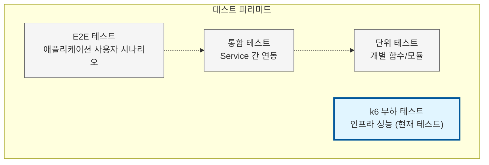

# k6 부하 테스트

k6를 사용한 Titanium 프로젝트 성능 테스트 스크립트입니다.

## 테스트 범위 및 목적

이 k6 테스트는 **인프라 성능 검증**에 초점을 맞춥니다.

### 테스트 목적

**인프라 계층 성능 측정**:
- 응답 시간 검증 (P95, P99 백분위수)
- 처리량 측정 (초당 요청 수)
- 자동 스케일링 동작 확인 (HPA)
- 시스템 안정성 및 에러율 모니터링

**모니터링 스택 검증**:
- Prometheus 메트릭 수집 확인
- Grafana 대시보드 데이터 시각화
- Istio Service Mesh 성능 영향 측정

### 테스트 범위

**포함되는 것**:
- HTTP GET 요청 기반 부하 테스트
- 주요 엔드포인트의 응답 시간 및 가용성
- 실제 사용자 트래픽 패턴 시뮬레이션 (GET 요청이 전체 트래픽의 80-90%)
- Kubernetes 리소스 사용률 및 스케일링 동작

**포함되지 않는 것**:
- 애플리케이션 로직 테스트 (단위 테스트, 통합 테스트에서 수행)
- 복잡한 사용자 여정 시나리오 (로그인, POST 요청 등)
- 데이터 정합성 및 트랜잭션 테스트
- API 엔드포인트별 상세 기능 검증

### 다른 테스트와의 관계



**이 테스트의 가치**:
- 인프라 변경(스케일링, 리소스 조정) 후 성능 영향 측정
- 운영 환경 배포 전 성능 기준선(baseline) 확인
- SLO(Service Level Objective) 달성 여부 자동 검증

## 테스트 스크립트

### 1. quick-test.js (빠른 테스트)
- **소요 시간**: 약 2분
- **시나리오**:
  - 30초: 10명의 동시 사용자로 증가
  - 1분: 10명 유지
  - 30초: 0명으로 감소
- **용도**: 빠른 기능 검증 및 기본 성능 확인

### 2. load-test.js (부하 테스트)
- **소요 시간**: 약 10분
- **시나리오**:
  - 1분: 10명으로 증가
  - 2분: 10명 유지
  - 1분: 50명으로 증가
  - 2분: 50명 유지
  - 1분: 100명으로 증가
  - 2분: 100명 유지
  - 1분: 0명으로 감소
- **용도**: 실제 부하 상황에서의 성능 및 안정성 검증

## 테스트 엔드포인트

모든 테스트는 다음 엔드포인트를 검증합니다:

1. **Dashboard** (`/`)
   - 응답 시간 < 1초
   - 상태 코드: 200

2. **Blog** (`/blog/`)
   - 응답 시간 < 1초
   - 상태 코드: 200

3. **Blog API** (`/blog/api/posts`)
   - 응답 시간 < 500ms
   - 상태 코드: 200

4. **Health Check** (`/health`)
   - 응답 시간 < 200ms
   - 상태 코드: 200

## 성능 목표 (Thresholds)

k6는 다음 threshold를 사용하여 테스트 성공/실패를 자동 판단합니다:

| Threshold | 목표 | 설명 |
|-----------|------|------|
| `http_req_duration` | P95 < 500ms | 95%의 요청이 500ms 이내 응답 |
| `http_req_failed` | < 1% | HTTP 요청 실패율 1% 미만 |
| `checks` | > 99% | 체크 성공률 99% 이상 |

**개선 사항**:
- 표준 k6 메트릭 활용 (`checks`, `http_req_failed`)
- 불필요한 커스텀 메트릭 제거 (이전 `errors` 메트릭)
- 더 명확한 threshold 정의

## 사용 방법

### 방법 1: 실행 스크립트 사용 (권장)

```bash
# Quick 테스트 실행
./scripts/run-k6-test.sh quick

# Load 테스트 실행
./scripts/run-k6-test.sh load
```

### 방법 2: k6 직접 실행

```bash
# BASE_URL 자동 설정
NODE_IP=$(kubectl get nodes -o jsonpath='{.items[0].status.addresses[?(@.type=="InternalIP")].address}')
NODEPORT=$(kubectl get svc -n istio-system istio-ingressgateway -o jsonpath='{.spec.ports[?(@.name=="http2")].nodePort}')
BASE_URL="http://${NODE_IP}:${NODEPORT}"

# Quick 테스트
BASE_URL=$BASE_URL k6 run tests/performance/quick-test.js

# Load 테스트
BASE_URL=$BASE_URL k6 run tests/performance/load-test.js
```

### 방법 3: Docker 사용 (k6 미설치 시)

```bash
# Quick 테스트
docker run --rm -i -e BASE_URL=http://10.0.11.168:31304 grafana/k6 run - <tests/performance/quick-test.js

# Load 테스트
docker run --rm -i -e BASE_URL=http://10.0.11.168:31304 grafana/k6 run - <tests/performance/load-test.js
```

## k6 설치

### macOS (Homebrew)
```bash
brew install k6
```

### Ubuntu/Debian
```bash
sudo gpg -k
sudo gpg --no-default-keyring --keyring /usr/share/keyrings/k6-archive-keyring.gpg --keyserver hkp://keyserver.ubuntu.com:80 --recv-keys C5AD17C747E3415A3642D57D77C6C491D6AC1D69
echo "deb [signed-by=/usr/share/keyrings/k6-archive-keyring.gpg] https://dl.k6.io/deb stable main" | sudo tee /etc/apt/sources.list.d/k6.list
sudo apt-get update
sudo apt-get install k6
```

### Windows (Chocolatey)
```bash
choco install k6
```

## 결과 파일

테스트 실행 후 다음 위치에 결과가 저장됩니다:

- Quick 테스트: `tests/performance/quick-results.json`
- Load 테스트: `tests/performance/results.json`

## 환경 변수

- `BASE_URL`: 테스트 대상 URL (기본값: `http://10.0.11.168:31304`)

## 결과 분석

k6 테스트 결과에서 주요 확인 지표:

- `http_req_duration`: 요청 응답 시간
  - `p(95)`: 95 백분위수 응답 시간 (목표: < 500ms)
  - `p(99)`: 99 백분위수 응답 시간
- `http_req_failed`: 실패한 요청 비율 (목표: < 1%)
- `checks`: 성공한 체크 비율 (목표: 100%)
- `vus`: 가상 사용자 수
- `iterations`: 총 반복 횟수

## 문제 해결

### k6가 설치되지 않았습니다
위의 "k6 설치" 섹션을 참고하여 k6를 설치하거나, Docker를 사용하세요.

### Cluster에 접근할 수 없습니다
```bash
# Kubernetes 컨텍스트 확인
kubectl config current-context

# Cluster 상태 확인
kubectl cluster-info
```

### 타임아웃 또는 연결 오류
```bash
# Istio Ingress Gateway 상태 확인
kubectl get svc -n istio-system istio-ingressgateway

# Pod 상태 확인
kubectl get pods -n titanium-prod
```
